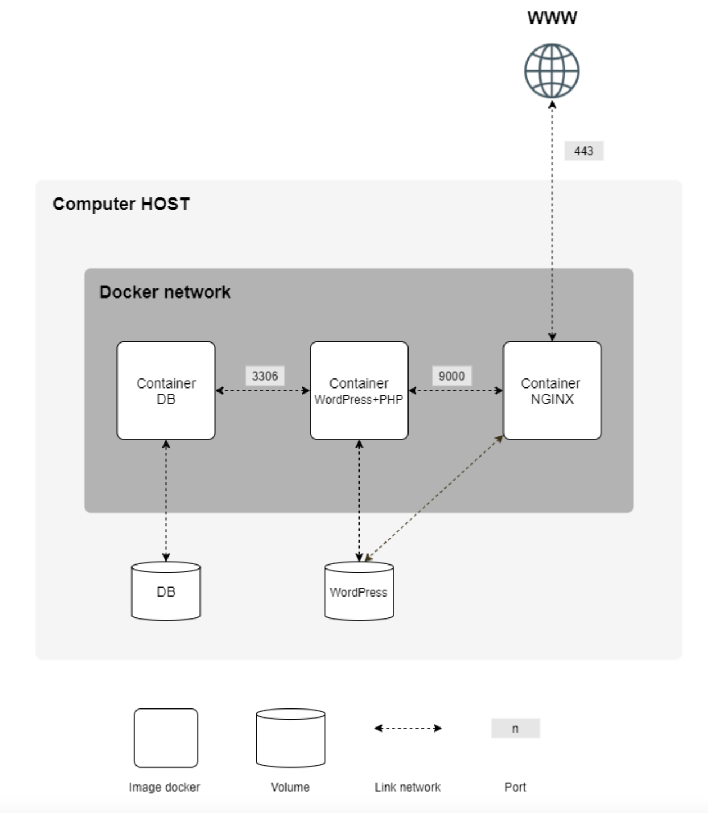

## inception

project of 42 school where it is necessary to create LEMP via docker-compose on localhost.

the linked docker network consists of several services like nginx with TLSv1.3 protocol, wordpress + php-fpm and mariaDB.

each service runs in a separate container with a custom dockerfile.

also services have volumes on the server for data safety.



### how to use
before launching `docker` and `docker-compose` should be installed.

hostname, password and username for mysql you can find in the `.env` file.

**to launch the project:**
```
make
```
go to the site `https://127.0.0.1` to see starting wp page.

**to check wp admin dashboard:**

in wordpress database, there are two users, one of them is the administrator.

visit `https://127.0.0.1/wp-login.php`

`Jack Sparrow` `oaAAz#qyFgQTbUrDW(b*Z1pT`

`Captain Salazar` `c7khJJSd0NO8dsT@lAKoHa(#`

**to check mysql:**

enter mysql container to see existing users.
```
docker exec -it mariadb sh
mysql -h mariadb -u constbar -p
blackpearl
use wordpress;
select * from wp_users;
```
**to stop the project:**

the next command will also delete all docker images, pay attention.
```
make fclean
sudo rm -rf ../../../constbar
```

